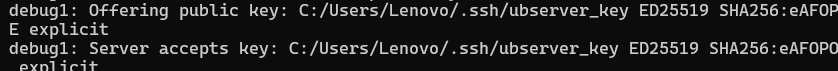

# 🔑 One-line summary
```
scp -i private_key local_file user@server:/path
```
---

## 📤 Copy file FROM CMD → Linux server (using SSH key)
Basic command

```
scp -i %USERPROFILE%\.ssh\ubserver_key test.txt jarvis@192.168.1.105:/home/jarvis/
```


---

## 📥 Copy file FROM server → CMD

```
scp -i %USERPROFILE%\.ssh\ubserver_key jarvis@192.168.1.105:/home/jarvis/test.txt .

```


## 📂 Copy a directory (very common)

Folder copied from a server to local machine
```
scp -i %USERPROFILE%\.ssh\ubserver_key -r myfolder jarvis@192.168.1.105:/home/jarvis/
```


## 🧪 Verify which key is used (debug)

```
scp -v -i %USERPROFILE%\.ssh\ubserver_key test.txt jarvis@192.168.1.105:/home/jarvis/
```



Look for `Offering public key: ubserver_key
Authentication succeeded (publickey).
`

---
# Exit with the Code 0
