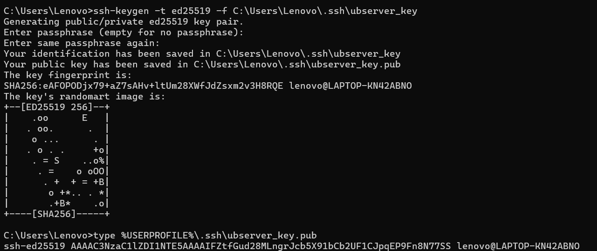
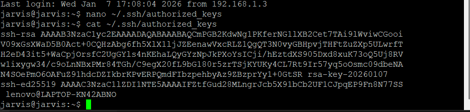
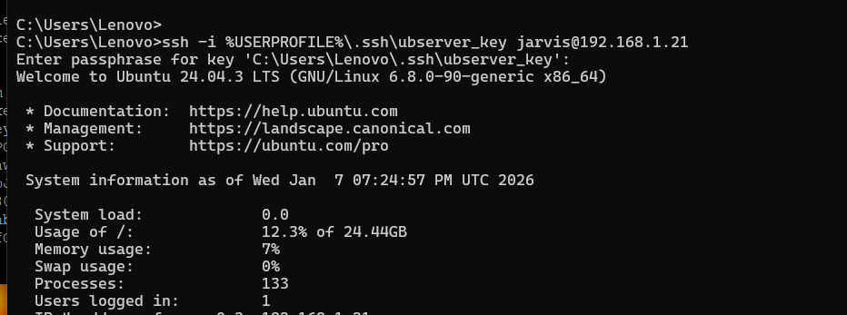

# What we will do

**Create a new OpenSSH key (for CMD / automation)**

- Add its public key to the same server

- Keep existing PuTTY access working

  **Create a ssh-key and save in Client machine**

    For creating `ssh-key`

    ```
    ssh-keygen -t ed25519 -f %USERPROFILE%\.ssh\azure_cmd_key
    ```
    ```
    This is a example
    
    # C:\Users\Lenovo>ssh-keygen -t ed25519 -f C:\Users\Lenovo\.ssh\ubserver_key

    ```

- %USERPROFILE% is a Windows environment variable.

    Example:
   `%USERPROFILE%  →  C:\Users\Saumitra`

- Now, check the public key

    To view the public key:
    `type %USERPROFILE%\.ssh\azure_cmd_key.pub`



---
**Add the public key in the Server**

- Login in server.
- Type `nano ~/.ssh/authorized_keys`
  >code with caution
- Add the public key
- To copy in Nano use : 
   
   - shift + insert or
   - right click - it will paste the key.

   check with the arrow key.
   - Ctrl + o (save)
   - ctrl + x (exit)
   - ctrl + c (cancel)   

- Do not remove the Old ssh-key created with puttygen
- Check the keys
 ```
 cat ~/.ssh/authorized_keys
```



---
**Try to login**

Type and update accordingly.
```
ssh -i %USERPROFILE%\.ssh\azure_cmd_key jarvis@192.1258.1.105

```


**And it worked !!**