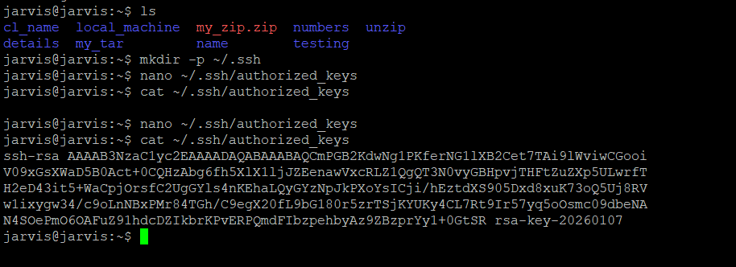
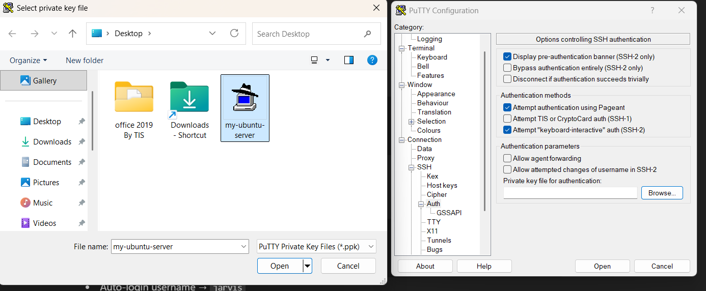
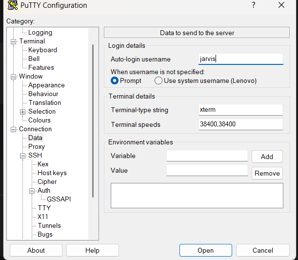
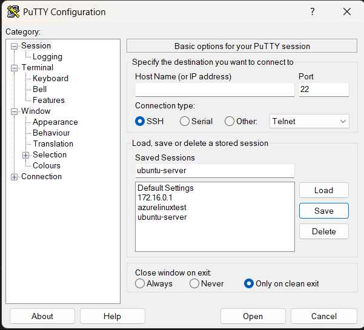

# 🔐 Passwordless SSH Login to Ubuntu Server Using PuTTY

This guide explains how to connect to an **Ubuntu Server** using **PuTTY** and then configure **passwordless SSH login** using a `.ppk` private key.

---

## Part 1: Login to Ubuntu Server Using PuTTY (Password-Based)

### 1️⃣ Open PuTTY

Fill in the following details:

- **Host Name (or IP address)** → `192.168.1.105`
- **Port** → `22`
- **Connection type** → `SSH`

Click **Open**

👉 First time connection → click **Accept**

Enter:
- **Username**: `jarvis`
- **Password**: *(Ubuntu user password)*

✅ You are now logged in to the server using PuTTY.

---

##  PART 2: Passwordless Login with PuTTY (PRO Way)

PuTTY uses **`.ppk` private keys**, not `id_rsa`.  
So we generate keys using **PuTTYgen**.

---

🔑 STEP 1: Generate SSH Key Using PuTTYgen

1. Open **PuTTYgen**
2. Click **Generate**
3. Move the mouse randomly to generate entropy
4. Key will be generated

Optional:
- Set a **Key passphrase** for extra security

👉 Click **Save private key**

Save as:
```text
ubuntu-key.ppk
```


  
---
## **Saved the public key to ubuntu server**
🔓 STEP 2: Copy Public Key to Ubuntu Server

In **PuTTYgen**, copy the text from:


Now, in the **PuTTY terminal (already logged in)**, run:

```bash
mkdir -p ~/.ssh
nano ~/.ssh/authorized_keys
```
📋 Paste the Public Key

Right-click inside the PuTTY window to paste the key

The key will appear as one long line



---

## **Changing File permission**

🔐 Set Correct Permissions (Mandatory)

Run the following commands on the server:
```
chmod 700 ~/.ssh
chmod 600 ~/.ssh/authorized_keys

✅ Expected Permissions
drwx------ ~/.ssh
-rw------- authorized_keys
```

---
## **Config Putty to use private key**


🔐 STEP 3: Configure PuTTY to Use Private Key

Open PuTTY → Settings

Navigate to:

`Connection → SSH → Auth`


Click Browse

`Select ubuntu-key.ppk`



---
## **Add the Auto login username**

Then go to:

`Connection → Data`


`Set Auto-login username → jarvis`



## **Save the Session**

💾 STEP 4: Save the PuTTY Session (VERY IMPORTANT)

Go to:

Session

`
Saved Sessions → Ubuntu-Server`

Click Save

👉 Next time, just double-click the session 😎

