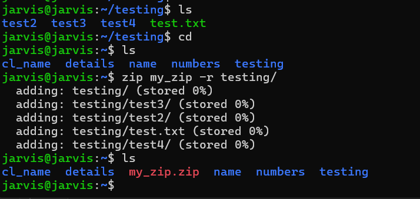
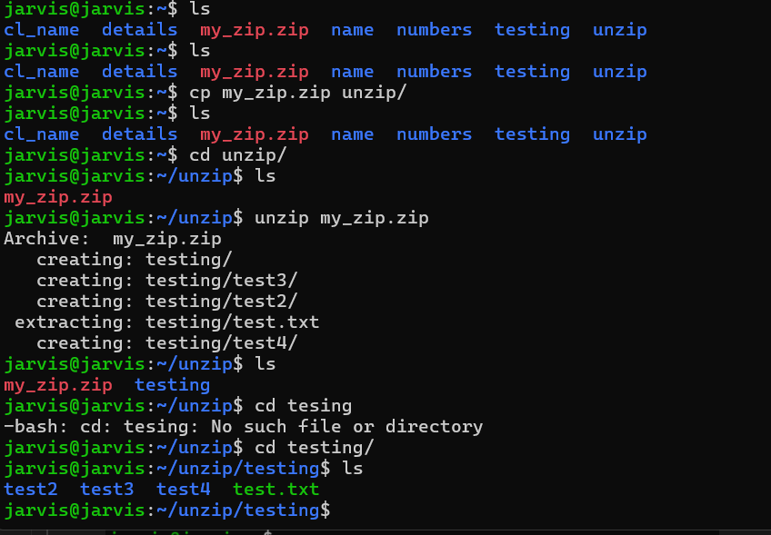

# Archives & Compression

### `tar`
🧠 Memory Trick

c → create

x → extract

t → list

z → gzip

v → verbose

f → file

| Flag | Description                               |
| ---- | ----------------------------------------- |
| `-c` | Create a new archive                      |
| `-x` | Extract an archive                        |
| `-t` | List archive contents                     |
| `-f` | Specify archive file name (**mandatory**) |
| `-v` | Verbose output (shows progress)           |

| Flag | Compression Type | File Extension |
| ---- | ---------------- | -------------- |
| `-z` | gzip             | `.tar.gz`      |
| `-j` | bzip2            | `.tar.bz2`     |
| `-J` | xz               | `.tar.xz`      |


Create/extract/list tar:
```bash
tar -cvf archive.tar folder/
tar -xvf archive.tar
tar -tvf archive.tar

#for gzip-compressed archive/extract/list 

tar -czvf file.tar.gz ops/   # create + compress
tar -xzvf file.tar.gz        # extract
tar -tvf file.tar.gz         # list contents

```


### `gzip`
Compress or decompress files.

Gun Zip
Example:
```
gzip
```

### `zip, unzip`
Common archive utilities.

Example:
zip

> use flag `r` for zipping folder



```
zip filename.zip -r folder/

```
For `unzip`



```
unzip zipfile.zip
```

### `sudo install zip -y`
To install zip

Example:
```
sudo install zip -y
```